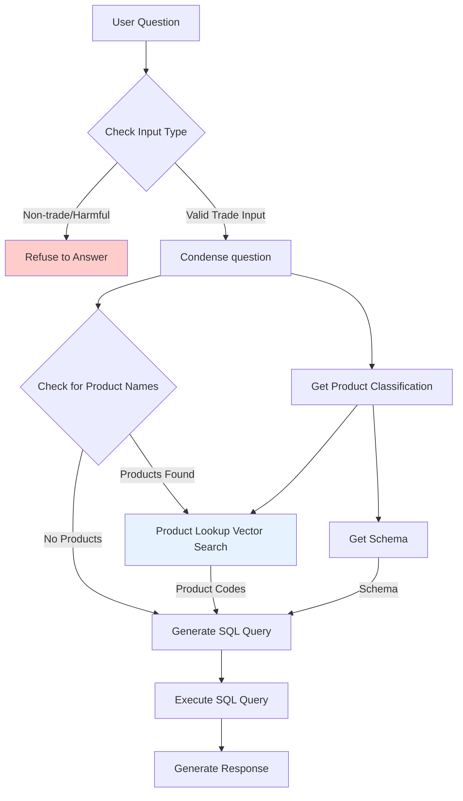

# Ask-Atlas

Ask-Atlas is a chatbot that allows users to ask questions about the Atlas database and receive answers. It is a RAG chatbot that uses Langchain, Chainlit, and OpenAI's LLMs (GPT-4o, GPT-4o-mini).

