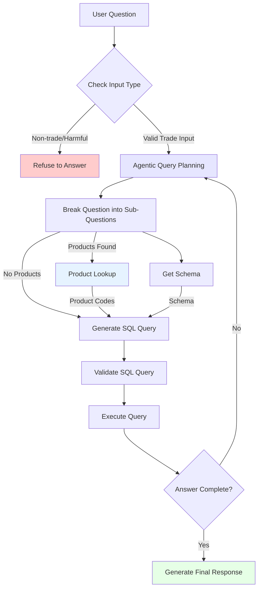

# Ask-Atlas

Ask-Atlas is an AI agent designed to answer questions about international trade data using the Atlas of Economic Complexity database. It leverages a combination of LangChain, Streamlit, and Large Language Models (LLMs) to answer user queries.

## Features
- **Natural Language to SQL:** Converts user questions into optimized SQL queries.
- **Trade-Specific Query Processing:** Supports multiple product classifications (SITC, HS 1992, 2012, etc.) and looks up product codes separately first before generating SQL queries.
- **Agentic Query Planning:** Breaks complex queries into sub-questions and executes them sequentially.
- **Interactive Follow-ups:** Maintains conversation history, allowing users to ask follow-up questions.
- **Safe and Relevant Responses:** Automatically filters harmful or irrelevant questions.

## Workflow Overview

## Usage
Ask-Atlas supports natural language queries about international trade data. Example questions:

- *"What were the top 5 products exported by the US to China in 2020?"*
- *"How did Brazil's wheat exports change between 2010 and 2020?"*
- *"What services did India export to the US in 2021?"*

Users can refine their queries or ask follow-ups, and the system will maintain context.

## Planned Enhancements
- **Advanced Query Optimization:** Improving SQL generation efficiency.
- **Adding evals**: Adding a set of evals to the project with an LLM-as-a-judge to check for correctness against a range of known questions and answers.
- **FastAPI Integration**: Integrating the existing project with a FastAPI backend so that the system can be deployed on other services such as Slack, an app, or even integrated into the Atlas.

## Acknowledgments
Ask-Atlas relies on the Atlas trade database curated by the Harvard Growth Lab. Thanks to the Growth Lab development team for maintaining the database and making a copy available specifically for this project.
