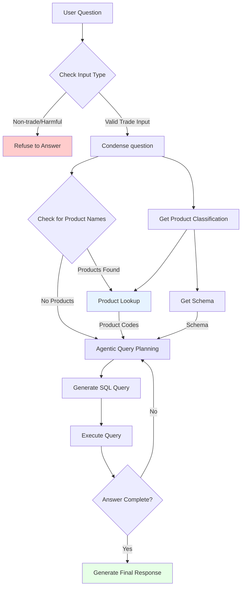

# Ask-Atlas

Ask-Atlas is a chatbot that allows users to ask questions about the Atlas database and receive answers. It is a RAG chatbot that uses Langchain, Streamlit, and LLM's from either OpenAI, Anthropic, or Google (whichever one seems to be performing best at the time).

