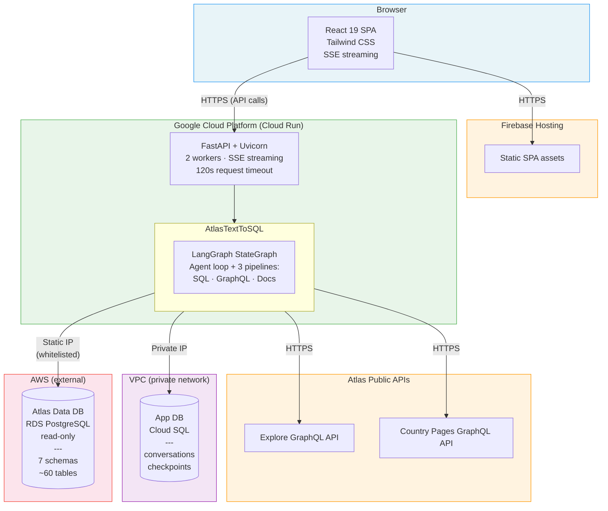
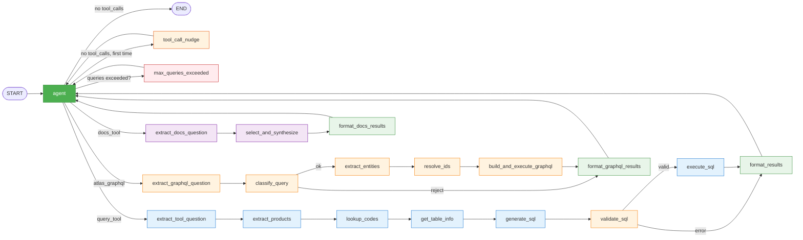
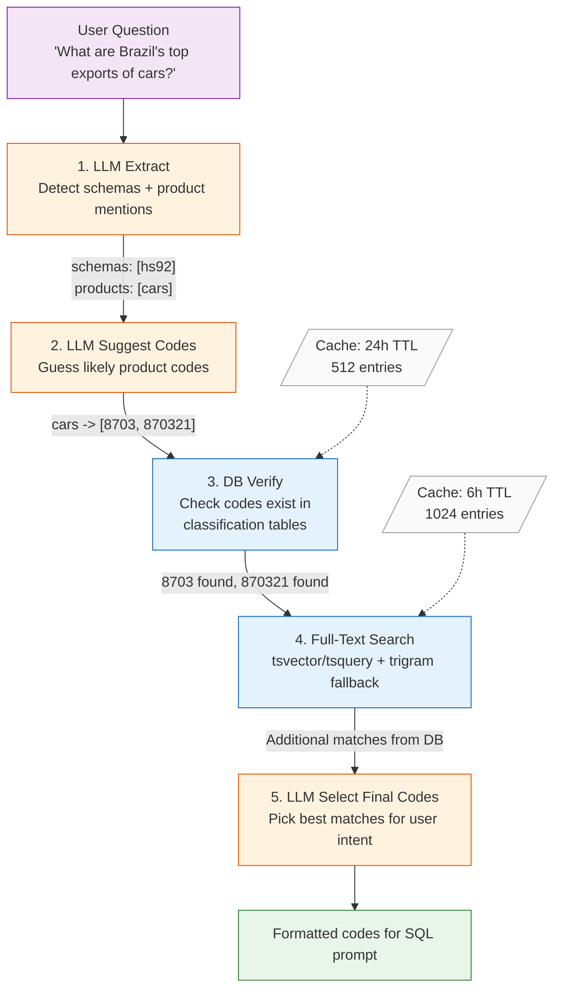
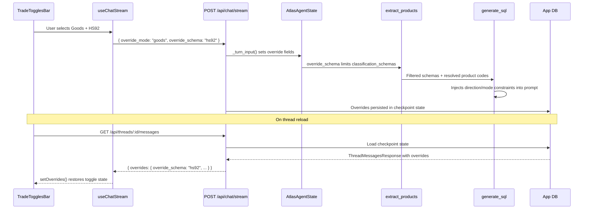
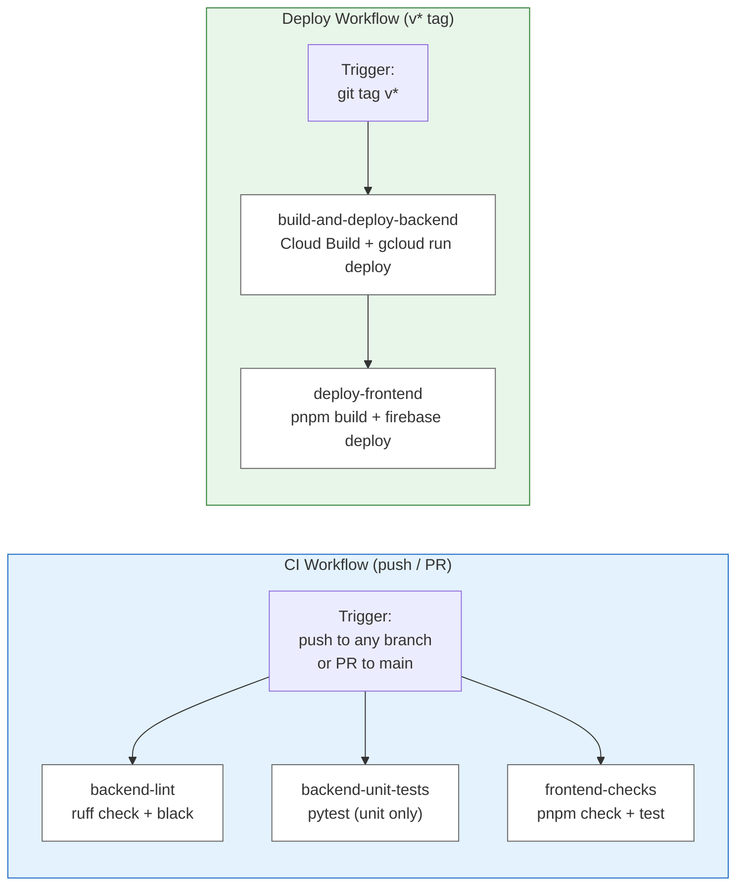

# Ask Atlas — Technical Overview

Ask Atlas is an AI-powered agent that answers natural language questions about international trade using data from the [Atlas of Economic Complexity](https://atlas.hks.harvard.edu/). It combines a LangGraph multi-tool agent (Python/FastAPI backend) with a React SPA frontend, deployed on Google Cloud Platform. The agent routes questions through three pipelines — SQL (text-to-SQL against the Atlas database), GraphQL (Atlas public APIs for visualizations and pre-computed data), and Docs (internal documentation for methodology questions). This document is the definitive technical reference for any human or LLM agent working on the project.

---

## Table of Contents

1. [Repository Layout](#repository-layout)
2. [System Architecture](#system-architecture)
3. [Database Architecture](#database-architecture)
4. [Backend Architecture](#backend-architecture)
5. [Product Code Resolution](#product-code-resolution)
6. [FastAPI Server](#fastapi-server)
7. [Caching](#caching)
8. [SQL Validation](#sql-validation)
9. [Atlas Link Generation](#atlas-link-generation)
10. [Frontend Architecture](#frontend-architecture)
11. [Trade Override System](#trade-override-system)
12. [Deployment & Infrastructure](#deployment--infrastructure)
13. [Testing](#testing)
14. [Evaluation System](#evaluation-system)
15. [Technical Metrics Reference](#technical-metrics-reference)
16. [Known Technical Debt](#known-technical-debt)
17. [Roadmap](#roadmap)

---

## Repository Layout

```
ask-atlas/
├── src/                            # Python backend
│   ├── api.py                      # FastAPI server, endpoints, SSE streaming
│   ├── streaming.py                # AtlasTextToSQL orchestrator, StreamData, answer/stream logic
│   ├── graph.py                    # build_atlas_graph — LangGraph StateGraph assembly
│   ├── agent_node.py               # make_agent_node — LLM agent with tool selection
│   ├── state.py                    # AtlasAgentState TypedDict (SQL + GraphQL + Docs fields)
│   ├── prompts.py                  # All LLM prompts (agent, SQL, GraphQL, docs)
│   ├── config.py                   # Pydantic Settings (loads from .env + model_config.py)
│   ├── model_config.py             # Non-secret LLM settings (model names, prompt assignments)
│   ├── sql_pipeline.py             # SQL pipeline nodes (extract → generate → validate → execute)
│   ├── graphql_pipeline.py         # GraphQL pipeline nodes (classify → extract → resolve → execute)
│   ├── graphql_client.py           # Async GraphQL HTTP client, circuit breaker, budget tracker
│   ├── docs_pipeline.py            # Docs pipeline nodes (select → synthesize)
│   ├── docs/                       # Markdown documentation files (YAML frontmatter, loaded at startup)
│   ├── atlas_links.py              # Deterministic Atlas visualization URL builder
│   ├── product_and_schema_lookup.py  # Product code resolution pipeline
│   ├── sql_validation.py           # sqlglot-based SQL validation
│   ├── sql_multiple_schemas.py     # SQLDatabaseWithSchemas (LangChain workaround)
│   ├── cache.py                    # TTL caches, CatalogCache (country/product/services), registry
│   ├── persistence.py              # Checkpointer + app table setup
│   ├── conversations.py            # Conversation metadata store
│   ├── error_handling.py           # Retry logic with exponential backoff
│   ├── schema/                     # db_table_descriptions.json + db_table_structure.json
│   ├── example_queries/            # Few-shot SQL examples for prompt
│   ├── setup/                      # One-time DB setup scripts
│   ├── text_to_sql.py              # Backward-compatibility shim → streaming.py
│   └── tests/                      # Backend test suite
│       ├── conftest.py             # Shared fixtures
│       ├── fake_model.py           # FakeToolCallingModel for unit tests
│       └── fixtures/               # Test seed data
├── frontend/                       # React SPA (independent toolchain)
│   ├── src/
│   │   ├── App.tsx                 # Router: / and /chat/:threadId
│   │   ├── pages/                  # LandingPage, ChatPage
│   │   ├── hooks/                  # useChatStream, useConversations, useTradeToggles
│   │   ├── components/
│   │   │   ├── chat/               # MessageList, ChatInput, PipelineStepper, SqlBlock,
│   │   │   │                       # GraphqlSummaryBlock, DocsBlock, AtlasLinks, etc.
│   │   │   ├── workspace/          # ChatWorkspace, LeftSidebar, CenterPanel
│   │   │   ├── landing/            # Landing page sections
│   │   │   └── ui/                 # Primitives (Button, Card, Input, Collapsible)
│   │   ├── types/chat.ts           # TypeScript type definitions
│   │   ├── utils/                  # session.ts, pipeline-type.ts, step-detail.ts, entity-colors.ts
│   │   └── config.ts               # API_BASE_URL from env
│   ├── vite.config.ts              # Dev proxy /api → localhost:8000
│   └── package.json                # pnpm, React 19, Vite 7, Tailwind 4
├── evaluation/                     # Eval harness
│   ├── eval_questions.json         # Question bank with categories/difficulty
│   ├── run_eval.py                 # Entry point: run agent + judge + report
│   ├── run_agent_evals.py          # Concurrent agent evaluation
│   ├── judge.py                    # LLM-as-judge (3 modes)
│   ├── report.py                   # JSON + Markdown report generation
│   ├── questions/                  # Per-question directories
│   └── results/                    # Ground truth query results
├── app.py                          # Legacy Streamlit entry point
├── Dockerfile                      # Multi-stage build
├── cloudbuild.yaml                 # Cloud Build config
├── docker-compose.test.yml         # Test databases (Postgres 16)
├── .github/workflows/
│   ├── ci.yml                      # Lint + unit tests + frontend checks
│   └── deploy.yml                  # Build + deploy on git tag
└── docs/
    ├── public/                      # Non-sensitive docs (committed to repo)
    │   ├── architecture.md          # This file
    │   ├── backend_architecture.md  # Hybrid GraphQL+SQL backend reference
    │   └── deferred_graphql_discrepancies.md  # GraphQL tech debt tracker
    ├── private/                     # Sensitive docs (gitignored)
    ├── atlas/                       # Atlas public content (gitignored)
    ├── resources/                   # Academic papers (gitignored)
    └── media/                       # Screen recordings (gitignored)
```

---

## System Architecture



**Key design decisions:**
- **Two-database architecture**: Atlas trade data is externally managed on AWS (read-only); app state lives in a Cloud SQL instance the project controls.
- **SSE streaming**: The frontend connects directly to Cloud Run for `/api/chat/stream` (Firebase Hosting was buffering the full SSE response before forwarding).
- **Stateless scaling**: No session affinity. Conversation state is persisted in the App DB via LangGraph's `AsyncPostgresSaver`.
- **VPC egress**: All Cloud Run traffic routes through a static IP so the AWS RDS security group can whitelist it.

---

## Database Architecture

### Atlas Data DB (`ATLAS_DB_URL`)

Read-only PostgreSQL database managed externally on AWS RDS. Contains international trade data organized across 7 schemas.

#### Classification Schema

Shared lookup tables for products and locations.

| Table | Purpose | Key Columns |
|-------|---------|-------------|
| `location_country` | Country master data | `country_id`, `iso3_code`, `name_en`, `in_rankings` |
| `location_group` | Country groupings (regions, blocs) | `group_id`, `group_type`, `group_name` |
| `location_group_member` | Country-to-group mapping | `group_id`, `country_id` |
| `product_hs92` | HS 1992 product hierarchy | `product_id`, `code`, `product_level` (1-6), `parent_id` |
| `product_hs12` | HS 2012 product hierarchy | Same structure as HS92 |
| `product_sitc` | SITC product hierarchy | `product_id`, `code`, `product_level` (1-4), `parent_id` |
| `product_services_unilateral` | Services (unilateral) | `product_id`, `code`, `product_level` (1-6) |
| `product_services_bilateral` | Services (bilateral) | `product_id`, `code`, `product_level` (1-6) |

All product tables include: name variants (EN/ES), product space coordinates (`ps_x`, `ps_y`), and hierarchical links (`parent_id`, `top_parent_id`).

#### Trade Data Schemas (hs92, hs12, sitc, services_unilateral, services_bilateral)

Each schema follows identical table patterns at multiple product-level granularities:

| Table Pattern | Purpose | Key Columns |
|---------------|---------|-------------|
| `country_product_year_{1,2,4,6}` | Unilateral trade by product | `country_id`, `product_id`, `year`, `export_value`, `import_value`, `export_rca`, `cog`, `distance` |
| `country_country_product_year_{1,2,4,6}` | Bilateral trade (exporter→importer) | `country_id`, `partner_id`, `product_id`, `year`, `export_value`, `import_value` |
| `country_year` | Aggregate country indicators | `country_id`, `year`, `eci`, `coi`, `diversity`, `gdp_ppp`, `population` |
| `product_year_{1,2,4,6}` | Global product aggregates | `product_id`, `year`, `export_value`, `import_value` |
| `country_country_year` | Bilateral relatedness | `country_id`, `partner_id`, similarity metrics |
| `group_group_product_year_{1,2,4,6}` | Trade between country groups | `group_id`, `partner_id`, `product_id`, `year` |
| `country_year_thresholds` | Statistical benchmarks | `year`, `variable`, `mean`, `median`, percentiles |

Trade values are `BIGINT`. Complexity metrics (`export_rca`, `eci`, `cog`, `distance`) are `DOUBLE PRECISION`. Location-level filtering uses `ENUM` types (`country`, `group`).

#### Public Schema

| Table | Purpose |
|-------|---------|
| `data_flags` | Country eligibility flags (`rankings_eligible`, `in_cp`, etc.) |
| `year` | Yearly deflators for inflation adjustment |

### App DB (`CHECKPOINT_DB_URL`)

Application-owned PostgreSQL on Cloud SQL. Tables are auto-created by `src/persistence.py` on first connection.

| Table | Purpose | Owner |
|-------|---------|-------|
| `conversations` | Thread metadata (id, session_id, title, timestamps) | `src/conversations.py` |
| `checkpoints` | LangGraph checkpoint records | `langgraph-checkpoint-postgres` |
| `checkpoint_writes` | Checkpoint write operations | `langgraph-checkpoint-postgres` |
| `checkpoint_blobs` | Large checkpoint data | `langgraph-checkpoint-postgres` |

---

## Backend Architecture

### AtlasTextToSQL Orchestrator (`src/streaming.py`)

The top-level class that owns all backend resources. Created once at server startup and shared across requests. (`src/text_to_sql.py` is a backward-compatibility shim that re-exports from `src/streaming.py`.)

**Factory**: `await AtlasTextToSQL.create_async(db_uri, ...)` — no public constructor. The factory:
1. Creates sync and async SQLAlchemy engines
2. Builds an `SQLDatabaseWithSchemas` instance for metadata reflection
3. Loads table descriptions, table structure, and example queries from JSON files
4. Creates frontier and lightweight LLMs via `create_llm()`
5. Initializes `AsyncCheckpointerManager` for conversation persistence
6. Initializes GraphQL clients (`AtlasGraphQLClient`) for Explore and Country Pages APIs
7. Initializes `CatalogCache` instances for country, product, and services lookups
8. Compiles the LangGraph `StateGraph` via `build_atlas_graph()`

**Streaming entry point**: `aanswer_question_stream(question, thread_id, override_schema, override_direction, override_mode, override_agent_mode)` returns an `AsyncGenerator[StreamData]`. Each `StreamData` carries:
- `source` — originating node or layer
- `content` — text content
- `message_type` — one of: `agent_talk`, `tool_call`, `tool_output`, `node_start`, `pipeline_state`
- `payload` — structured data for pipeline events

**Pipeline sequences** (displayed in UI):

SQL pipeline (8 nodes):

| Order | Node Name | UI Label |
|-------|-----------|----------|
| 1 | `extract_tool_question` | Extracting question |
| 2 | `extract_products` | Identifying products |
| 3 | `lookup_codes` | Looking up product codes |
| 4 | `get_table_info` | Loading table metadata |
| 5 | `generate_sql` | Generating SQL query |
| 6 | `validate_sql` | Validating SQL |
| 7 | `execute_sql` | Executing query |
| 8 | `format_results` | Formatting results |

GraphQL pipeline (6 nodes):

| Order | Node Name | UI Label |
|-------|-----------|----------|
| 1 | `extract_graphql_question` | Extracting question |
| 2 | `classify_query` | Classifying query type |
| 3 | `extract_entities` | Extracting entities |
| 4 | `resolve_ids` | Resolving entity IDs |
| 5 | `build_and_execute_graphql` | Executing GraphQL query |
| 6 | `format_graphql_results` | Formatting results |

Docs pipeline (3 nodes):

| Order | Node Name | UI Label |
|-------|-----------|----------|
| 1 | `extract_docs_question` | Extracting question |
| 2 | `select_and_synthesize` | Selecting and synthesizing docs |
| 3 | `format_docs_results` | Formatting results |

### LangGraph StateGraph (`src/graph.py`)

`build_atlas_graph()` builds a compiled `StateGraph[AtlasAgentState]` with an outer agent loop and three inner deterministic pipelines (SQL, GraphQL, Docs).

**Agent tools**: The agent selects from three tools per turn:
- **`query_tool`** — Routes to the SQL pipeline for custom database queries
- **`atlas_graphql`** — Routes to the GraphQL pipeline for Atlas visualization data and pre-computed metrics
- **`docs_tool`** — Routes to the Docs pipeline for methodology/documentation questions (bypasses query budget)

**Agent mode** (`AgentMode` enum) controls which tools are available:
- `AUTO` — All three tools; agent chooses dynamically. Falls back to SQL_ONLY if GraphQL budget exhausted.
- `GRAPHQL_SQL` — `query_tool` + `atlas_graphql` + `docs_tool`
- `SQL_ONLY` — `query_tool` + `docs_tool` only
- `GRAPHQL_ONLY` — `atlas_graphql` + `docs_tool` only

**Graph topology:**



**Key design decisions** (see `docs/public/backend_architecture.md` for full rationale):

1. **Flat graph, no subgraphs.** Subgraphs would cleanly isolate pipeline state, but are incompatible with the dual-mode streaming architecture (`stream_mode=["messages", "updates"]`). At ~17 nodes, the graph is manageable with pipeline-prefixed state fields (`pipeline_*`, `graphql_*`, `docs_*`).

2. **Atlas link generation is combined with `resolve_ids`, not a separate node.** Link generation is deterministic and takes microseconds — running it in parallel with the ~100-500ms GraphQL API call saves no perceptible latency. Combining it with `resolve_ids` (which already has all the data) is simpler.

3. **Classification and entity extraction are separate LLM calls.** The `classify_query` → `extract_entities` split keeps each call focused. Early rejection at classification saves an LLM call. Extraction prompts are tailored per classified `query_type`.

4. **Dynamic tool binding in agent node.** The `agent_node` resolves the effective mode per-turn (checking budget tracker + circuit breaker for AUTO mode) and adjusts which tools and system prompt the LLM sees.

5. **Anti-hallucination nudge.** If the agent tries to respond without calling any tool (e.g., answering from its training data), a `tool_call_nudge` node fires once to redirect it toward data tools. This prevents hallucinated trade statistics.

6. **Error recovery — all pipeline nodes are non-fatal.** Every node catches exceptions and writes errors to state rather than raising. The format node returns an informative error `ToolMessage` to the agent, which can then fall back to another tool or inform the user.

7. **Structured output conventions.** All structured output schemas in the GraphQL pipeline use: (a) description constants for Literal fields (module-level strings with `- value : explanation`), (b) a `reasoning: str` field placed first for chain-of-thought, (c) `with_structured_output(Model, include_raw=True)` for provider-agnostic constrained generation.

8. **Token usage and cost tracking.** Every LLM call records input/output token counts to `token_usage` state via a custom reducer. At stream end, per-model cost is estimated using `MODEL_PRICING` in `src/model_config.py` and returned in the `done` SSE event.

**Cross-pipeline verification**: The agent naturally cross-verifies results between SQL and GraphQL when results seem implausible. No special mechanism is needed — the ReAct loop supports multi-turn tool calls. The agent's system prompt includes verification guidance: "If a result seems implausible, verify by querying the other data source."

**SQL pipeline node details** (`src/sql_pipeline.py`):

1. **`agent`** (`src/agent_node.py`) — LLM decides which tool to call or responds directly. The system prompt instructs it to check for harmful/off-topic content and verify the question is about international trade. The LLM sees the full message history including previous results.

2. **`extract_tool_question`** — Extracts the `question` argument from the tool call.

3. **`extract_products`** — Calls `ProductAndSchemaLookup.aextract_schemas_and_product_mentions_direct()` to identify classification schemas and product mentions. Applies user overrides (`override_schema`, `override_mode`) if set.

4. **`lookup_codes`** — Resolves product mentions to database codes via the [product code resolution pipeline](#product-code-resolution). Uses async engine with caching.

5. **`get_table_info`** — Loads DDL and descriptions for relevant tables based on detected schemas. Cached with 1-hour TTL.

6. **`generate_sql`** — Builds a few-shot prompt with table metadata, product codes, direction/mode constraints, and example queries. Invokes the frontier LLM via `create_query_generation_chain()`.

7. **`validate_sql`** — Runs `validate_sql()` from `src/sql_validation.py`. On failure, sets `last_error` to short-circuit past execution.

8. **`execute_sql`** — Runs the query against the Atlas Data DB using the async engine. Wrapped in `async_execute_with_retry()` (3 attempts, exponential backoff). Returns columns, rows, row count, and execution time.

9. **`format_results`** — Packages results into a `ToolMessage` for the agent to interpret. Increments `queries_executed`.

10. **`max_queries_exceeded`** — Returns an error `ToolMessage` when `queries_executed >= max_queries_per_question`.

**GraphQL pipeline node details** (`src/graphql_pipeline.py`):

1. **`extract_graphql_question`** — Extracts question + context from tool args, resets GraphQL state fields.

2. **`classify_query`** — Lightweight LLM classifies the query into one of ~20 types (e.g., `country_profile`, `treemap_products`, `feasibility`, `bilateral_aggregate`) or `reject`. Determines `api_target` (explore vs. country_pages) and `product_level`.

3. **`extract_entities`** — Lightweight LLM extracts structured entities: countries, products, years, groups.

4. **`resolve_ids`** — Dual-source ID resolution (mirrors the SQL pipeline's product resolution pattern):
   - **Step A**: Verify LLM-guessed standard codes (ISO alpha-3 for countries, HS/SITC for products) against cached catalogs.
   - **Step B**: Text-search entity names in catalogs for additional candidates.
   - **Step C**: Lightweight LLM selects best IDs from both sources based on question context.
   - **Step D**: Generate Atlas links inline via `generate_atlas_links()` (deterministic, microseconds).
   - Finally, format IDs for the target API (Explore uses integer IDs like `countryId: 404`; Country Pages uses prefixed strings like `"location-404"`).

5. **`build_and_execute_graphql`** — Constructs the GraphQL query from resolved params, executes against the Explore or Country Pages API via `AtlasGraphQLClient`. Catches all errors and writes them to state (never raises). Consumes one budget token on success.

6. **`format_graphql_results`** — Formats API response as readable text, attaches Atlas visualization links to state, returns a `ToolMessage` with answer text + links. On rejection or API failure, returns an informative error message.

**Docs pipeline node details** (`src/docs_pipeline.py`):

1. **`extract_docs_question`** — Extracts question + context from tool args.

2. **`select_and_synthesize`** — Lightweight LLM selects up to `max_docs_per_selection` relevant docs from a pre-loaded manifest (YAML frontmatter in `src/docs/*.md`), then synthesizes a response.

3. **`format_docs_results`** — Returns the synthesized response as a `ToolMessage`.

**Query generation chain** (SQL): LCEL composition: `prompt | llm | StrOutputParser() | _strip`. The prompt injects:
- Table DDL with descriptions
- Resolved product codes
- Direction/mode constraints
- Few-shot example queries (loaded from `src/example_queries/`)
- Domain rules (product_id vs. product_code, country_id vs. iso3_code, RCA/ECI/PCI definitions, market share calculation, new products definition)
- Optional context from docs_tool if used earlier in the turn

### AtlasAgentState (`src/state.py`)

`TypedDict` with fields organized by pipeline. Three fields use custom reducers: `messages` uses LangGraph's `add_messages` (append-only), `turn_summaries` uses `add_turn_summaries` (append-only), `token_usage` uses `add_token_usage` (append-only).

| Field | Type | Purpose |
|-------|------|---------|
| **Core** | | |
| `messages` | `Annotated[list[BaseMessage], add_messages]` | Full conversation history (reducer: append) |
| `queries_executed` | `int` | SQL/GraphQL queries run this turn |
| `last_error` | `str` | Most recent error (empty if none) |
| `retry_count` | `int` | Current retry attempts |
| `turn_summaries` | `Annotated[list[dict], add_turn_summaries]` | Per-turn structured summaries (reducer: append) |
| `token_usage` | `Annotated[list[dict], add_token_usage]` | Per-node LLM token usage records (reducer: append) |
| **Overrides** | | |
| `override_schema` | `Optional[str]` | User-specified classification (hs92/hs12/sitc) |
| `override_direction` | `Optional[str]` | User-specified trade direction (exports/imports) |
| `override_mode` | `Optional[str]` | User-specified trade mode (goods/services) |
| `override_agent_mode` | `Optional[str]` | Per-request agent mode (auto/sql_only/graphql_sql) |
| **SQL pipeline** | | |
| `pipeline_question` | `str` | Extracted question from tool call |
| `pipeline_context` | `str` | Optional context from agent's tool call args |
| `pipeline_products` | `Optional[SchemasAndProductsFound]` | Product/schema extraction result |
| `pipeline_codes` | `str` | Formatted product codes for SQL prompt |
| `pipeline_table_info` | `str` | Table DDL/descriptions |
| `pipeline_sql` | `str` | Generated SQL query |
| `pipeline_result` | `str` | Formatted query result string |
| `pipeline_result_columns` | `list[str]` | Column names from query |
| `pipeline_result_rows` | `list[list]` | Row data |
| `pipeline_execution_time_ms` | `int` | Query execution time |
| **GraphQL pipeline** | | Reset by `extract_graphql_question` at cycle start |
| `graphql_question` | `str` | Extracted question from GraphQL tool call |
| `graphql_context` | `str` | Conversational context for the GraphQL question |
| `graphql_classification` | `Optional[dict]` | Classification result (query_type, api_target, etc.) |
| `graphql_entity_extraction` | `Optional[dict]` | Extracted entities (country, product, year, etc.) |
| `graphql_resolved_params` | `Optional[dict]` | Resolved entity IDs and API parameters |
| `graphql_query` | `Optional[str]` | Constructed GraphQL query string |
| `graphql_api_target` | `Literal["explore", "country_pages"] \| None` | Target API identifier |
| `graphql_raw_response` | `Optional[dict]` | Raw response from GraphQL API |
| `graphql_execution_time_ms` | `int` | GraphQL query execution time |
| `graphql_atlas_links` | `list[dict]` | Generated Atlas visualization links |
| **Docs pipeline** | | Reset by `extract_docs_question` at cycle start |
| `docs_question` | `str` | Extracted question from docs_tool call |
| `docs_context` | `str` | Broader user context for the docs question |
| `docs_selected_files` | `list[str]` | Filenames selected by the LLM |
| `docs_synthesis` | `str` | Synthesized documentation response |

### Configuration (`src/config.py`, `src/model_config.py`)

**`src/model_config.py`** (checked into source, non-secret):
```python
FRONTIER_MODEL = "gpt-5.2"           # Complex reasoning, agent orchestration, SQL generation
FRONTIER_MODEL_PROVIDER = "openai"
LIGHTWEIGHT_MODEL = "gpt-5-mini"     # Extraction, classification, selection
LIGHTWEIGHT_MODEL_PROVIDER = "openai"
AGENT_MODE = "auto"                  # "auto", "graphql_sql", "sql_only", or "graphql_only"
MAX_DOCS_PER_SELECTION = 3
PROMPT_MODEL_ASSIGNMENTS = {         # Maps each prompt to "frontier" or "lightweight"
    "agent_system_prompt": "frontier",
    "sql_generation": "frontier",
    "graphql_classification": "lightweight",
    "graphql_entity_extraction": "lightweight",
    "id_resolution_selection": "lightweight",
    "product_extraction": "lightweight",
    "product_code_selection": "lightweight",
    "document_selection": "lightweight",
    "documentation_synthesis": "lightweight",
}
```

**`Settings`** (Pydantic BaseSettings, loaded from `.env`):

| Field | Default | Purpose |
|-------|---------|---------|
| `atlas_db_url` | (required) | Atlas Data DB connection string |
| `checkpoint_db_url` | `None` | App DB connection string |
| `openai_api_key` | `None` | OpenAI API key |
| `anthropic_api_key` | `None` | Anthropic API key |
| `google_api_key` | `None` | Google API key |
| `frontier_model` | from `model_config.py` | Frontier model for complex reasoning |
| `frontier_model_provider` | from `model_config.py` | Provider for frontier model |
| `lightweight_model` | from `model_config.py` | Lightweight model for extraction/classification |
| `lightweight_model_provider` | from `model_config.py` | Provider for lightweight model |
| `agent_mode` | `"auto"` | Operating mode (auto/graphql_sql/sql_only/graphql_only) |
| `prompt_model_assignments` | from `model_config.py` | Per-prompt model tier routing |
| `graphql_explore_url` | Atlas public API | Explore GraphQL API endpoint |
| `graphql_country_pages_url` | Atlas public API | Country Pages GraphQL API endpoint |
| `max_docs_per_selection` | `3` | Max docs the docs tool can select per invocation |
| `max_queries_per_question` | `30` | Max SQL queries per user question |
| `max_results_per_query` | `15` | Max rows returned per query |
| `cors_origins` | `""` | Additional CORS origins (comma-separated) |
| `enable_langsmith` | `True` | LangSmith tracing toggle |

**`create_llm(model, provider, **kwargs)`** — Factory function routing to `ChatOpenAI`, `ChatAnthropic`, or `ChatGoogleGenerativeAI` based on the provider string.

**`get_prompt_model(prompt_key)`** — Looks up the model tier for a prompt key in `prompt_model_assignments` and returns the corresponding frontier or lightweight LLM instance.

### Prompts (`src/prompts.py`)

Central registry for all LLM prompts. Zero imports from other `src/` modules (prevents circular dependencies). Each prompt is assigned to either the frontier or lightweight model tier via `PROMPT_MODEL_ASSIGNMENTS`.

| Prompt Key | Model Tier | Purpose |
|------------|-----------|---------|
| `agent_system_prompt` | Frontier | Agent orchestration: tool selection, budget status, verification guidance, trade data schema |
| `sql_generation` | Frontier | SQL query generation with few-shot examples, table DDL, domain rules |
| `graphql_classification` | Lightweight | Classify user question into ~20 GraphQL query types or reject |
| `graphql_entity_extraction` | Lightweight | Extract structured entities (countries, products, years) given classified query type |
| `id_resolution_selection` | Lightweight | Select best entity IDs from dual-source candidates |
| `product_extraction` | Lightweight | Identify products and classification schemas in user question |
| `product_code_selection` | Lightweight | Select final product codes from LLM + DB candidates |
| `document_selection` | Lightweight | Select relevant docs from manifest based on user question |
| `documentation_synthesis` | Lightweight | Synthesize response from selected documentation files |

---

## Product Code Resolution

The pipeline in `src/product_and_schema_lookup.py` resolves natural language product mentions (e.g., "cars", "crude oil") into database product codes. This is a critical step — incorrect codes produce wrong SQL queries.

### Pipeline Stages



**Stage details:**

| Stage | Function | Notes |
|-------|----------|-------|
| 1. LLM Extract | `aextract_schemas_and_product_mentions_direct()` | Uses lightweight model. Returns `SchemasAndProductsFound` |
| 2. LLM Suggest | Part of `aget_candidate_codes()` | LLM guesses likely HS/SITC codes |
| 3. DB Verify | `_aget_official_product_details()` | Cached (24h TTL). Checks codes exist in `classification.product_*` |
| 4. Full-Text Search | `_adirect_text_search()` | Cached (6h TTL). PostgreSQL `tsvector`/`tsquery` with trigram fallback |
| 5. LLM Select | `aselect_final_codes_direct()` | Uses lightweight model. Returns `ProductCodesMapping` |

### Key Data Classes

- **`SchemasAndProductsFound`** — `classification_schemas: list[str]`, `products: list[ProductDetails]`, `requires_product_lookup: bool`
- **`ProductDetails`** — `name: str`, `classification_schema: str`, `codes: list[str]`
- **`ProductSearchResult`** — `name: str`, `classification_schema: str`, `llm_suggestions: list[dict]`, `db_suggestions: list[dict]`
- **`ProductCodesMapping`** — `mappings: list[ProductDetails]` (final selected codes)

### Schema-to-Table Mapping

```python
SCHEMA_TO_PRODUCTS_TABLE_MAP = {
    "hs92":                  "classification.product_hs92",
    "hs12":                  "classification.product_hs12",
    "sitc":                  "classification.product_sitc",
    "services_unilateral":   "classification.product_services_unilateral",
    "services_bilateral":    "classification.product_services_bilateral",
}
```

---

## FastAPI Server

### Application Lifecycle (`src/api.py`)

**Startup:**
1. Create `AtlasTextToSQL` instance via `create_async()` (loads DB schemas, compiles graph)
2. Select conversation store: `PostgresConversationStore` if `CHECKPOINT_DB_URL` is set, else `InMemoryConversationStore`
3. Log process ID and readiness

**Shutdown:**
1. Close `AtlasTextToSQL` (releases DB connections, checkpointer)
2. Clear conversation store reference

### Middleware Stack

| Middleware | Purpose | Details |
|------------|---------|---------|
| CORS | Cross-origin access | Dev origins (`localhost:5173/5174/4173`), production Firebase Hosting origins, plus `CORS_ORIGINS` env var |
| Request logging | Observability | Logs `→ METHOD PATH` on entry, `← METHOD PATH status=CODE Xms` on exit |
| Timeout | Prevent hanging | 120s timeout, returns `504 Gateway Timeout` |

### Endpoints

| Method | Path | Purpose | Auth |
|--------|------|---------|------|
| `GET` | `/health` | Health check (Cloud Run probes, Docker HEALTHCHECK) | None |
| `POST` | `/api/threads` | Generate new thread ID | None |
| `GET` | `/api/threads` | List conversations for session | `X-Session-Id` header |
| `GET` | `/api/threads/{thread_id}/messages` | Get message history + overrides + turn summaries | `X-Session-Id` header |
| `DELETE` | `/api/threads/{thread_id}` | Delete conversation + checkpoints | `X-Session-Id` header |
| `POST` | `/api/chat` | Non-streaming chat | None |
| `POST` | `/api/chat/stream` | SSE streaming chat | `X-Session-Id` header |
| `GET` | `/api/debug/caches` | Cache hit rate diagnostics | None |

### SSE Event Protocol

The `/api/chat/stream` endpoint returns `text/event-stream`. Events are sent in this order:

| Event | When | Payload |
|-------|------|---------|
| `thread_id` | First event | `{ "thread_id": "uuid" }` |
| `node_start` | Pipeline node begins | `{ "node": "extract_products", "label": "Identifying products", "query_index": 1 }` |
| `pipeline_state` | Pipeline node completes | Stage-specific structured data (schemas, products, SQL, results) |
| `agent_talk` | Agent generates text | `{ "source": "agent", "content": "token...", "message_type": "agent_talk" }` |
| `tool_call` | Agent calls tool | `{ "source": "agent", "content": "...", "name": "query_tool" }` |
| `tool_output` | Tool returns result | `{ "source": "...", "content": "..." }` |
| `done` | Stream complete | `{ "thread_id": "...", "total_queries": N, "total_rows": N, "total_execution_time_ms": N, "total_time_ms": N, "total_graphql_queries": N, "total_graphql_time_ms": N, "token_usage": {...}, "cost": {...}, "tool_call_counts": {...} }` |

**`pipeline_state` payloads vary by stage and pipeline:**

- **SQL pipeline:**
  - **`extract_products`**: `{ "stage": "extract_products", "schemas": [...], "products": [...] }`
  - **`execute_sql`**: `{ "stage": "execute_sql", "sql": "...", "columns": [...], "rows": [...], "row_count": N, "execution_time_ms": N, "tables": [...], "schema": "hs92" }`
- **GraphQL pipeline:**
  - **`classify_query`**: `{ "stage": "classify_query", "query_type": "...", "api_target": "...", "product_level": "..." }`
  - **`extract_entities`**: `{ "stage": "extract_entities", "country": "...", "product": "...", "year": "..." }`
  - **`resolve_ids`**: `{ "stage": "resolve_ids", "resolved_params": {...} }`
  - **`format_graphql_results`**: `{ "stage": "format_graphql_results", "atlas_links": [...], "execution_time_ms": N }`
- **Docs pipeline:**
  - **`select_and_synthesize`**: `{ "stage": "select_and_synthesize", "selected_files": [...], "synthesis": "..." }`
- Other stages: `{ "stage": "<node_name>", ... }` with stage-specific fields

### Conversation Tracking

Each request carries an `X-Session-Id` header (generated client-side via `crypto.randomUUID()`, persisted in `localStorage`). On first message in a thread, the server creates a `conversations` row linking the thread to the session. Subsequent messages update the `updated_at` timestamp.

**`ThreadMessagesResponse`** (returned by `GET /api/threads/{thread_id}/messages`):
```json
{
  "messages": [{"role": "human|ai", "content": "..."}],
  "overrides": {
    "override_schema": "hs92|hs12|sitc|null",
    "override_direction": "exports|imports|null",
    "override_mode": "goods|services|null"
  },
  "turn_summaries": [{
    "entities": {"products": [...], "schemas": [...]},
    "queries": [{"sql": "...", "columns": [...], "rows": [...], "row_count": N, "execution_time_ms": N}],
    "total_rows": N,
    "total_execution_time_ms": N
  }]
}
```

---

## Caching

### Per-Query TTL Caches

Three TTL caches with stampede prevention (`cachetools` + `cachetools-async`), managed by a `CacheRegistry` singleton in `src/cache.py`.

| Cache | Max Size | TTL | Key | Purpose |
|-------|----------|-----|-----|---------|
| `product_details_cache` | 512 | 24 hours | `(frozenset(codes), schema)` | Verified product codes + official names |
| `text_search_cache` | 1024 | 6 hours | `(normalized_search_term, schema)` | Full-text + trigram search results |
| `table_info_cache` | 32 | 1 hour | `frozenset(schemas)` | Table DDL + descriptions |

**Key normalization**: Product details keys use `frozenset` for order-independence. Text search keys normalize to lowercase with stripped whitespace.

### CatalogCache (Full Dataset Caches)

`CatalogCache` instances fetch entire catalogs from the Atlas GraphQL API and index them for O(1) lookups by multiple keys (ID, name, code). Three instances are created at startup:

| Cache | Source | Purpose |
|-------|--------|---------|
| `country_cache` | GraphQL API | Country name → ID resolution for GraphQL pipeline |
| `product_cache` | GraphQL API | Product name → ID/code resolution |
| `services_cache` | GraphQL API | Services product name → ID/code resolution |

Catalogs are lazy-loaded on first access and refreshed via TTL.

### GraphQL Budget Tracker & Circuit Breaker

`GraphQLBudgetTracker` (`src/graphql_client.py`) — Sliding-window rate limiter (~120 req/min). Uses consume-on-success semantics: budget tokens are consumed AFTER a successful HTTP response (2xx), not before — so a down API doesn't burn budget unnecessarily.

`CircuitBreaker` — Three states: CLOSED (normal) → OPEN (tripped after consecutive failures) → HALF_OPEN (recovery after timeout). Prevents cascading failures from a degraded Atlas API.

**Three-layer integration** controls GraphQL availability:

| Layer | Where | Check | Effect |
|-------|-------|-------|--------|
| 1. Mode resolution | `agent_node` (before each turn) | `budget_tracker.remaining() > 5 AND NOT circuit_breaker.is_open()` | Determines if agent sees `atlas_graphql` tool or falls back to SQL_ONLY |
| 2. Hard gate | `build_and_execute_graphql` | `budget_tracker.is_available()` | Race-condition safety: writes error if budget exhausted between tool call and execution |
| 3. Feedback | After HTTP call | Success → `consume()` + `record_success()`; Error → `record_failure()` only | Updates both budget and health state |

**API risk context**: The Atlas GraphQL API is provided by the Growth Lab as a courtesy for stand-alone analysis, not guaranteed for software integrations. The three-mode architecture (auto/graphql_sql/sql_only) ensures the system can always fall back to the SQL pipeline if the API changes or becomes unavailable.

**Diagnostics**: `GET /api/debug/caches` returns per-cache stats (size, maxsize, TTL, hits, misses, hit rate).

---

## SQL Validation

`validate_sql()` in `src/sql_validation.py` checks generated SQL before execution. Returns a `ValidationResult(is_valid, errors, warnings, sql)`.

**Validation steps:**

| Step | Check | Severity |
|------|-------|----------|
| 1 | Empty/whitespace-only SQL | Error (blocking) |
| 2 | Syntax via `sqlglot.parse_one()` (Postgres dialect) | Error (blocking) |
| 3 | Table existence (extracted table names vs. valid tables) | Error (blocking) |
| 4 | `SELECT *` usage | Warning (logged) |
| 5 | Leading `LIKE` wildcard (`LIKE '%...'`) | Warning (logged) |

On validation failure, `validate_sql_node` sets `state["last_error"]` which causes the graph to skip `execute_sql` and go directly to `format_results` with the error message.

---

## Atlas Link Generation

`src/atlas_links.py` is a standalone module with pure, deterministic functions — no LLM calls, no HTTP, no graph dependencies. It generates Atlas visualization URLs from `(query_type, resolved_params)`.

### URL Patterns

**Country Pages** (`https://atlas.hks.harvard.edu/countries/{m49_id}`):

| Query Type | URL Path |
|---|---|
| `country_profile` | `/countries/{id}` (+ supplementary subpages like `export-basket`, `export-complexity`) |
| `country_lookback` | `/countries/{id}/growth-dynamics` |
| `new_products` | `/countries/{id}/new-products` |

**Explore Pages** (`https://atlas.hks.harvard.edu/explore/{vizType}`):

| Visualization | URL Params |
|---|---|
| Treemap (products) | `?year={Y}&exporter=country-{id}` |
| Treemap (partners) | `?year={Y}&exporter=country-{id}&view=markets` |
| Time series | `?year={maxY}&startYear={minY}&endYear={maxY}&exporter=country-{id}` |
| Market share | Similar to time series |
| Product space | `?year={Y}&exporter=country-{id}` |
| Feasibility | `?year={Y}&exporter=country-{id}` (scatter and table views) |

Product IDs use internal numeric format (`product-HS92-726` for Coffee), NOT the HS code (0901). The mapping comes from the product catalog. Country IDs use M49 numeric codes (e.g., 404 for Kenya).

### Special Handling

- **Frontier countries** (USA, Germany, Japan, etc.): Country Pages subpages `growth-opportunities` and `product-table` are unavailable. The link generator falls back to Explore feasibility pages instead.
- **Multiple links per query**: Some query types generate primary + supplementary links (e.g., `treemap_products` generates both an Explore treemap link and a Country Page export-basket link).
- **Entity resolution transparency**: Each link carries `resolution_notes: list[str]` — empty for clean resolution, populated with human-readable notes for ambiguous cases (e.g., `"Product 'chips' resolved to Electronic integrated circuits (8542)"`).
- **No links for `global_datum` and `explore_data_availability`** — no corresponding Atlas pages exist.

### Data Structure

```python
@dataclass
class AtlasLink:
    url: str
    label: str
    link_type: Literal["country_page", "explore_page"]
    resolution_notes: list[str]  # Empty = clean resolution; non-empty = ambiguity notes
```

---

## Frontend Architecture

### Stack

- **React 19** with React Compiler (automatic memoization)
- **TypeScript 5.9** (type-checked via `tsgo`)
- **Vite 7** with dev proxy (`/api` → `http://localhost:8000`)
- **Tailwind CSS 4** (utility classes only, no custom CSS files)
- **pnpm 10** package manager (Node >=23)
- **Linting**: `@nkzw/oxlint-config` (strict rules: alphabetical object keys, no `console.log`, etc.)
- **Formatting**: `oxfmt` (auto-formatter, run via `pnpm format`)

### Routing

| Path | Component | Purpose |
|------|-----------|---------|
| `/` | `LandingPage` | Marketing page with hero, quick-start, data coverage sections |
| `/chat/:threadId?` | `ChatPage` | Main chat interface; `threadId` is optional |

### Two-Panel Layout

`ChatWorkspace` orchestrates a responsive two-panel layout:

```
┌──────────────┬──────────────────────────────────────────────┐
│  LeftSidebar │              CenterPanel                     │
│              │                                              │
│  New Chat    │  ChatTopBar                                  │
│  button      │  MessageList                                 │
│              │    WelcomeMessage                             │
│  Conversation│    UserMessage(s)                             │
│  list +      │    AssistantMessage(s)                        │
│  delete      │      SqlBlock + QueryResultTable              │
│              │      GraphqlSummaryBlock                      │
│              │      DocsBlock                                │
│              │      AtlasLinks                               │
│              │    PipelineStepper                             │
│              │    QueryContextCard (entities + stats)         │
│              │  TradeTogglesBar                               │
│              │  ChatInput                                     │
└──────────────┴──────────────────────────────────────────────┘
```

**Responsive behavior:**
- Desktop (>=1024px): Both panels visible, sidebar expanded
- Mobile: Sidebar collapses; clicking toggles overlay with backdrop

### Key Hooks

**`useChatStream`** (`frontend/src/hooks/use-chat-stream.ts`):
- Manages SSE connection to `/api/chat/stream`
- Parses chunked SSE responses, dispatches events by type
- Token buffering via `requestAnimationFrame` (~60fps flush rate)
- Thread history loading from `/api/threads/:threadId/messages`
- Query string auto-submit (`?q=` parameter)
- 30-second abort timeout
- Returns: `messages`, `pipelineSteps`, `entitiesData`, `queryStats`, `isStreaming`, `error`, `threadId`, `sendMessage`, `clearChat`

**`useConversations`** (`frontend/src/hooks/use-conversations.ts`):
- Fetches conversation list from `/api/threads`
- Optimistic delete with refetch fallback
- Returns: `conversations`, `isLoading`, `deleteConversation`, `refresh`

**`useTradeToggles`** (`frontend/src/hooks/use-trade-toggles.ts`):
- Local state for trade filter overrides (mode, schema, direction, systemMode)
- Auto-clears schema when mode is set to `services`
- `systemMode` controls agent mode override (auto/graphql_sql/sql_only)
- Returns: `overrides`, `setMode`, `setSchema`, `setDirection`, `setSystemMode`, `resetAll`, `setOverrides`

### Key Chat Components

| Component | File | Purpose |
|-----------|------|---------|
| `AssistantMessage` | `components/chat/assistant-message.tsx` | Renders markdown (react-markdown + GFM + KaTeX math) + embedded results |
| `PipelineStepper` | `components/chat/pipeline-stepper.tsx` | Timeline visualization (pulsing = active, check = complete); supports SQL, GraphQL, Docs pipelines |
| `SqlBlock` | `components/chat/sql-block.tsx` | Collapsible SQL code block with expand/collapse |
| `QueryResultTable` | `components/chat/query-result-table.tsx` | HTML table with column headers, NULL handling |
| `GraphqlSummaryBlock` | `components/chat/graphql-summary-block.tsx` | Displays GraphQL classification, entities, API target, execution time |
| `DocsBlock` | `components/chat/docs-block.tsx` | Displays docs consulted and synthesis |
| `AtlasLinks` | `components/chat/atlas-links.tsx` | Renders Atlas visualization links (country page / explore page) |
| `QueryContextCard` | `components/chat/query-context-card.tsx` | Inline entity badges, resolved codes, query stats |
| `TradeTogglesBar` | `components/chat/trade-toggles-bar.tsx` | Mode (Auto/Goods/Services) + Schema (Auto/HS92/HS12/SITC) + System mode toggles |
| `ChatInput` | `components/chat/chat-input.tsx` | Text input, Enter to send, Shift+Enter for newline |

---

## Trade Override System

A cross-cutting feature that lets users constrain queries to specific trade modes, classification schemas, and directions.

### Data Flow



**UI behavior:**
- Mode toggle: Auto | Goods | Services
- Schema toggle: Auto | HS92 | HS12 | SITC (hidden when mode = "services")
- System mode toggle: Auto | GraphQL+SQL | SQL Only (controls which pipelines are available)
- Overrides persist across messages in the same thread
- Overrides are restored when navigating back to a previous thread

---

## Deployment & Infrastructure

### GCP Resources

| Resource | Description |
|----------|-------------|
| GCP Project | Dedicated project in GCP |
| Region | `us-east1` |
| Cloud Run Service | `ask-atlas-backend` — serves the FastAPI app |
| Artifact Registry | Docker image repo (`ask-atlas/backend`) tagged per release |
| Cloud SQL Instance | `ask-atlas-app-db` — private IP within VPC (no public access) |
| VPC + Subnet | `ask-atlas-vpc` — Cloud Run egress routes through a reserved static IP |
| Static IP | Whitelisted on the AWS RDS security group for Atlas Data DB access |
| Firebase Hosting | Named site serving the built React SPA |
| Service Accounts | Compute SA for Cloud Run; GitHub Actions SA for CI/CD via Workload Identity Federation |
| WIF Pool/Provider | `github-pool` / `github-provider` — keyless auth for GitHub Actions |

### Cloud Run Configuration

| Setting | Value | Rationale |
|---------|-------|-----------|
| Port | 8000 | FastAPI/Uvicorn default |
| Memory | 1 GiB | Sufficient for LLM client + DB connections |
| CPU | 2 | Handles concurrent requests |
| CPU boost | Enabled | Faster cold starts |
| Timeout | 900s (15 min) | Long-running LLM queries |
| Concurrency | 10 | Max simultaneous requests per instance |
| Min instances | 0 | Scale to zero for cost savings |
| Max instances | 5 | Cost ceiling (~50 max concurrent requests) |
| Execution env | gen2 | Better networking, full Linux syscalls |
| HTTP/2 | Disabled | Simplicity for SSE streaming |
| Session affinity | Disabled | Stateless — state in DB |
| VPC egress | All traffic | Route through static IP for AWS RDS access |

### Docker Build (`Dockerfile`)

Two-stage build:

1. **Builder** (uv + Python 3.12 Bookworm): Installs dependencies via `uv sync --frozen --no-dev`, copies source
2. **Runtime** (Python 3.12 slim Bookworm): Copies `.venv` from builder, installs `libpq5`, creates non-root `atlas` user

Startup command: `uvicorn src.api:app --host 0.0.0.0 --port 8000 --workers 2 --timeout-keep-alive 65`

Health check: `python -c "import urllib.request; urllib.request.urlopen('http://localhost:8000/health')"` (30s interval, 15s start period)

### CI/CD



**CI** (`.github/workflows/ci.yml`) — three jobs run in parallel on every push and PR:

| Job | Steps |
|-----|-------|
| `backend-lint` | `uv run ruff check .` + `uv run black --check .` |
| `backend-unit-tests` | `pytest -m "not db and not integration and not eval"` |
| `frontend-checks` | `pnpm install --frozen-lockfile` + `pnpm check` + `pnpm test` |

**Deploy** (`.github/workflows/deploy.yml`) — triggered by `v*` tags, runs sequentially:

| Job | Steps |
|-----|-------|
| `build-and-deploy-backend` | Auth via WIF → Cloud Build (Docker image) → `gcloud run deploy` |
| `deploy-frontend` | (waits for backend) `pnpm build` → `firebase deploy --only hosting:app` |

Authentication uses Workload Identity Federation — no service account keys stored in GitHub.

---

## Testing

### Backend Test Tiers

| Tier | Marker | Dependencies | Speed | Command |
|------|--------|-------------|-------|---------|
| Unit | `not db and not integration and not eval` | None (mocked LLM + DB) | <30s | `PYTHONPATH=$(pwd) uv run pytest -m "not db and not integration and not eval"` |
| DB | `@pytest.mark.db` | Docker test DBs | <60s | `ATLAS_DB_URL=... CHECKPOINT_DB_URL=... pytest -m "db"` |
| Integration | `@pytest.mark.integration` | Real LLM API keys | Variable | `pytest -m "integration"` |
| Eval | `@pytest.mark.eval` | Real LLM + DB + LLM-as-judge | Slow | `pytest -m "eval"` |

**Test databases** (`docker compose -f docker-compose.test.yml up -d --wait`):
- Atlas data on port 5433 (seeded from `src/tests/fixtures/seed.sql`)
- App DB on port 5434

### Key Backend Test Files

| File | Coverage |
|------|----------|
| `test_pipeline_nodes.py` | Individual SQL node behavior with mocked LLM |
| `test_graph.py` | Graph assembly and multi-pipeline routing |
| `test_graph_wiring.py` | Graph edge routing |
| `test_sql_pipeline.py` | SQL pipeline nodes |
| `test_graphql_pipeline.py` | GraphQL pipeline (classify, extract, resolve, execute) |
| `test_graphql_client.py` | GraphQL HTTP client, circuit breaker, budget tracker |
| `test_docs_pipeline.py` | Docs pipeline (select, synthesize) |
| `test_atlas_links.py` | Atlas visualization URL generation |
| `test_sql_validation.py` | SQL validation rules |
| `test_product_and_schema_lookup.py` | Product resolution pipeline |
| `test_cache.py` | Cache registry, TTL, key normalization |
| `test_cache_catalogs.py` | CatalogCache behavior |
| `test_api.py` | FastAPI endpoint behavior |
| `test_state.py` | State reducers |
| `test_streaming.py` | AtlasTextToSQL streaming logic |
| `test_agent_node.py` | Agent node tool selection and mode resolution |
| `test_tool_routing.py` | Tool routing through graph |
| `test_prompts.py` | Prompt construction and formatting |
| `test_trade_overrides.py` | Override propagation through pipeline |
| `test_conversations.py` | Conversation store CRUD |
| `test_persistence.py` | Checkpointer manager |
| `test_config.py` | Settings and model config |
| `test_token_usage.py` | LLM token usage tracking and cost estimation |
| `test_pipeline_db_integration.py` | Full pipeline with real DB (`@pytest.mark.db`) |
| `test_agent_trajectory.py` | End-to-end agent behavior |
| `test_eval_guardrails.py` | Eval guardrail validation |
| `test_eval_report.py` | Eval report generation |

### Frontend Tests

Vitest with jsdom. Test files co-located as `*.test.tsx`.

| Command | Purpose |
|---------|---------|
| `pnpm test` | Run all tests (Vitest) |
| `pnpm check` | Type-check + lint + format-check (parallel) |

Key test files: `use-chat-stream.test.ts`, `use-chat-stream.integration.test.ts`, `use-conversations.test.ts`, `use-trade-toggles.test.ts`, `chat.test.tsx`, `chat.integration.test.tsx`, `landing.test.tsx`, `chat-workspace.test.tsx`, `left-sidebar.test.tsx`, `trade-toggles-bar.test.tsx`, `assistant-message.test.tsx`, `query-context-card.test.tsx`.

---

## Evaluation System

### Question Bank (`evaluation/eval_questions.json`)

```json
{
  "categories": [
    {"id": "export_analysis", "name": "Export Analysis"},
    ...
  ],
  "questions": [
    {
      "id": 1,
      "text": "What are the top 5 exports from India?",
      "category_id": "export_analysis",
      "difficulty": "easy",
      "expected_behavior": null
    }
  ]
}
```

Questions with `expected_behavior` set (e.g., "Should acknowledge data not available") test the agent's refusal behavior.

### Pipeline (`evaluation/run_eval.py`)

```bash
PYTHONPATH=$(pwd) uv run python evaluation/run_eval.py \
    [--questions QID1 QID2]   # Specific questions; default: all
    [--concurrency N]          # Max parallel runs; default: 3
    [--judge-model MODEL]      # Judge LLM; default: gpt-5-mini
    [--judge-provider PROVIDER] # Judge provider; default: openai
    [--skip-judge]             # Skip judging, agent results only
```

Steps:
1. Load questions from `eval_questions.json`
2. Run agent on each question concurrently (`evaluation/run_agent_evals.py`)
3. Load ground truth if available (`evaluation/results/{qid}/ground_truth/results.json`)
4. Judge each answer via LLM (`evaluation/judge.py`)
5. Generate reports (`evaluation/report.py`)

### Judge Modes (`evaluation/judge.py`)

| Mode | Trigger | Scoring | Pass Threshold |
|------|---------|---------|----------------|
| **Ground Truth** | Ground truth data available | Weighted: factual_correctness (0.35) + data_accuracy (0.30) + completeness (0.20) + reasoning_quality (0.15). Scale: 1-5. | Weighted score >= 3.5 |
| **Refusal** | `expected_behavior` field set | `appropriate_refusal` (bool) + `graceful` (bool) + score (1-5) | Score >= 4 |
| **Plausibility** | Neither of above | Real-world reasonableness, correct magnitude, realistic rankings. Score 1-5. | Score >= 4 |

### Reports (`evaluation/report.py`)

Output to `evaluation/runs/{timestamp}/`:
- **`report.json`** — Full results with per-question details, aggregates by category/difficulty, dimension averages
- **`report.md`** — Human-readable markdown with summary tables, failed question details

---

## Technical Metrics Reference

The Atlas database stores economic complexity metrics. Understanding these is essential for correct SQL generation.

| Metric | Column | Definition |
|--------|--------|------------|
| **RCA** | `export_rca` | Revealed Comparative Advantage. RCA > 1 means a country exports more of a product than the world average. |
| **ECI** | `eci` | Economic Complexity Index. Measures sophistication of a country's export basket. Higher = more complex economy. |
| **PCI** | (derived from product tables) | Product Complexity Index. Measures how complex a product is based on which countries export it. |
| **COI** | `coi` | Complexity Outlook Index. Measures how well-positioned a country is to move into more complex products. |
| **COG** | `cog` | Complexity Outlook Gain. The gain in COI a country would get from developing a new product. |
| **Distance** | `distance` | How far a product is from a country's current export capabilities. Lower = more achievable. |
| **Diversity** | `diversity` | Number of products a country exports with RCA > 1. |
| **Market Share** | (calculated) | `export_value / total_world_exports` for a product. Must be calculated via SQL, not stored directly. |
| **New Products** | `is_new` | Boolean. A product is "new" if a country recently gained RCA > 1 in it. |

---

## Known Technical Debt

### SQLDatabaseWithSchemas Workaround (`src/sql_multiple_schemas.py`)

LangChain's `SQLDatabase` does not support multiple schemas ([langchain#3036](https://github.com/langchain-ai/langchain/issues/3036)). `SQLDatabaseWithSchemas` subclasses it to reflect metadata across all 7 schemas, using schema-qualified table names (`schema.table`). This workaround carries maintenance burden and may break on LangChain upgrades.

### Sync Engine Retention

`AtlasTextToSQL` maintains both a sync `Engine` and an async `AsyncEngine`. The sync engine is still needed for:
- `SQLDatabaseWithSchemas` metadata reflection (which uses sync SQLAlchemy internals)
- Some `get_table_info` paths that delegate to the `SQLDatabase` parent class

Fully eliminating the sync engine requires either an async-compatible `SQLDatabase` or replacing `SQLDatabaseWithSchemas` entirely.

### Backward-Compatibility Shim (`src/text_to_sql.py`)

`src/text_to_sql.py` is a one-line shim that re-exports everything from `src/streaming.py`. It exists for backward compatibility with code that imported from the old module name. Can be removed once all consumers are updated.

### Streamlit Legacy (`app.py`)

The `app.py` Streamlit entry point still exists but is not the production frontend. It served as the original development UI before the React SPA was built. It remains for local development convenience but is not deployed or tested in CI.

### In-Memory Fallbacks

Both the checkpointer (`MemorySaver`) and conversation store (`InMemoryConversationStore`) have in-memory fallbacks when `CHECKPOINT_DB_URL` is not set. These work for single-process development but lose state on restart and don't work across multiple Uvicorn workers.

---

## Roadmap

Prioritized open issues from [GitHub](https://github.com/shreyasgm/ask-atlas/issues).

### Bugs

| # | Title | Labels |
|---|-------|--------|
| 93 | GraphQL Explore API responses overflow agent context window for data-rich queries | bug |
| 79 | Product code resolution works rarely, mostly because of LLM non-determinism | bug, backend |
| 74 | Not functional after migration to ask-atlas-gl | bug |
| 70 | Default classification schema for Goods should be HS2012 | bug, backend |

### Feature Enhancements

| # | Title | Labels |
|---|-------|--------|
| 96 | Parallel tool execution (docs + data) | enhancement |
| 95 | Within-session docs synthesis dedup | enhancement |
| 94 | Revisit agent base system prompt for token efficiency | — |
| 78 | Add suggestion pills below assistant responses | enhancement |
| 77 | Show resolved entities inline in chat messages instead of sidebar | frontend |
| 76 | Remove right sidebar panel from chat workspace | frontend |
| 75 | Add a "loading" indicator after user submits query | — |
| 71 | Add HS digit-level toggle (4-digit / 6-digit / Auto) | cross-stack |
| 67 | Add Firebase Auth to protect API endpoints | cross-stack |
| 68 | Add per-user rate limiting | backend |
| 58 | Add Upstash Redis as shared cache tier | backend |
| 34 | HITL product picker API | backend |
| 32 | Product Code Picker disambiguation modal | frontend |
| 23 | Typeahead autocomplete for products/countries | backend |

### Infrastructure & Quality

| # | Title | Labels |
|---|-------|--------|
| 90 | Evaluation Judge Extensions & Trajectory Testing | testing, eval |
| 89 | Evaluation Dataset Collection (Phase 0 + Phase 1) | eval |
| 73 | Design and build for mobile | frontend |
| 72 | Add dark mode support | frontend |
| 69 | Set up GCP billing alerts | infrastructure |
| 64 | Add usage analytics and monitoring | — |
| 61 | Review updated Atlas database and adapt backend | backend |
| 60 | Run full evals and produce performance report | eval |
| 57 | Research modern chatbot UI patterns | frontend |
| 56 | Frontend test strategy audit | frontend |
| 55 | Frontend code audit | frontend |
| 39 | Add Playwright E2E tests | testing |

### Completed (formerly tracked here)

| # | Title | Status |
|---|-------|--------|
| 42 | Hybrid backend: GraphQL API alongside SQL | Implemented — GraphQL pipeline now live alongside SQL |
| 15 | Decompose monolithic query tool into separate tools | Implemented — agent now has `query_tool`, `atlas_graphql`, `docs_tool` |
| 54 | Design and implement technical info injection | Implemented — docs pipeline with `src/docs/` manifest |
| 48 | Add Atlas verification links to responses | Implemented — `src/atlas_links.py` + `AtlasLinks` frontend component |
| 62 | SSE streaming broken: Firebase Hosting buffers response | Fixed — frontend connects directly to Cloud Run |
| 63 | Backend CORS whitelist missing production origins | Fixed |
| 65 | Trade toggle bar truncated on mobile viewport | Fixed |
| 66 | GitHub link in header points to wrong repository | Fixed |
| 80 | Config & Model Naming Refactor | Implemented |
| 81 | GraphQL HTTP Client, Budget Tracker & Circuit Breaker | Implemented |
| 82 | Atlas Link Generation Module | Implemented |
| 83 | Cache Extensions for GraphQL Catalogs | Implemented |
| 84 | GraphQL Pipeline Nodes | Implemented |
| 85 | Graph Rewrite & Agent Node | Implemented |
| 86 | Streaming & API Updates for GraphQL | Implemented |

### Deferred

| # | Title | Labels |
|---|-------|--------|
| 16 | Human-in-the-loop approval for expensive queries | cross-stack |
| 52 | Add web search tool | backend |
